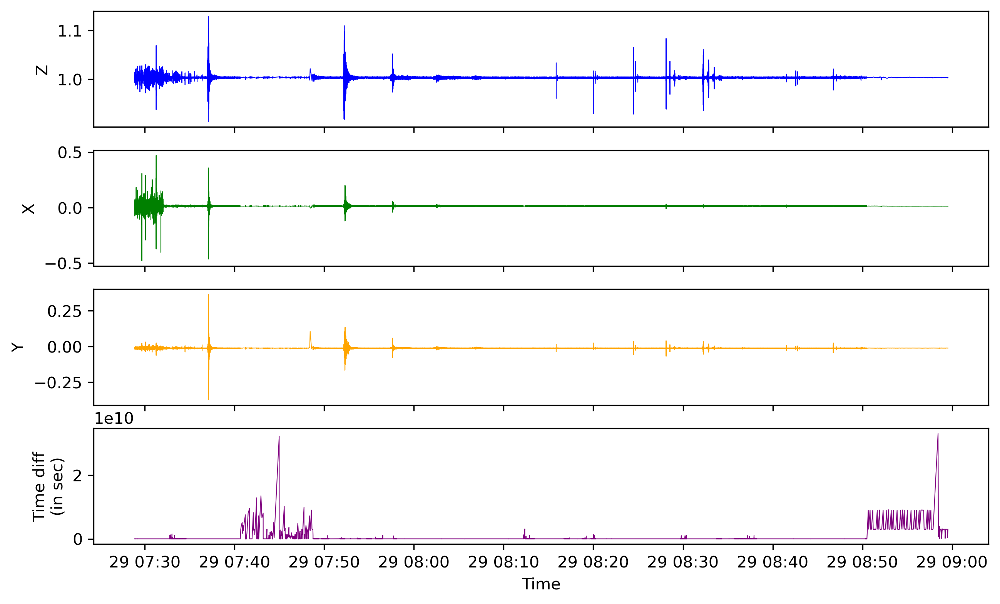
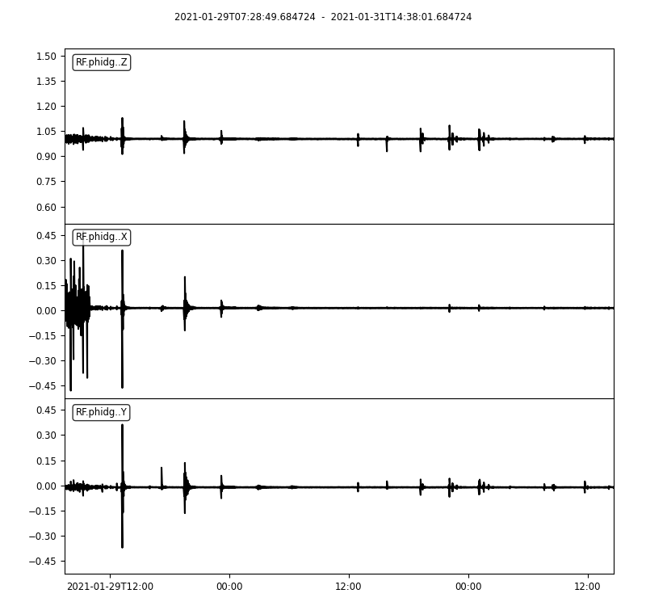

<h1>Analysis of the recordings from the Phidget Spatial Sensor</h1> 

<code>Utpal Kumar</code>

<h2><code>analyze_csv_data.py</code></h2> 

Reads the sequential csc files in the directory csvdata and 
write it into mseed files using different interpolation algorithms; also plot the three component recording from the csv file

  

<h2><code>analyze_mseed_data.py</code></h2> 

Reads the mseed data interpolated using different algorithms and plot it

    
    
weighted_average_slopes

    
    
lanczos

